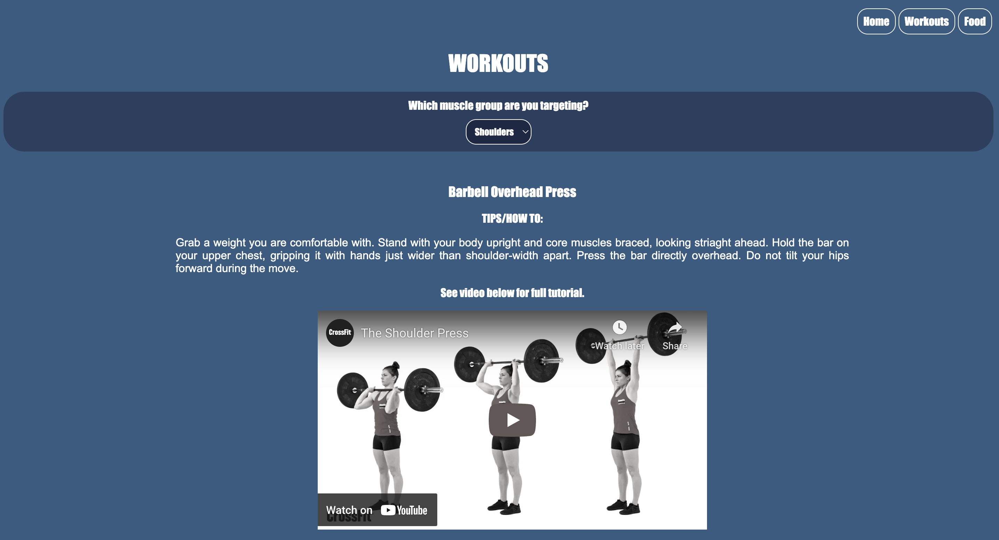

# Project 3: Workout Buddy 

## Description 

The purpose of this project is to work as a development team to create a website that acts as a "Workout Buddy" in order to assist the user to stay fit, healthy and motivated. The site allows the user to log in and post and access their daily thoughts throughout their fitness journey. There is a "Workout" page where workout routines are pre-built based on targeted muscle groups, where tutorials and helpful descriptions are provided for each exercise. Additionally, there is a "Food" page where healthy recipes are displayed based on desired cuisine options (Asian, Mexican, etc.). Once a cuisine type is selected, a list of healthy meals is displayed with follow-along recipe video tutorials. 

## Table of Contents

- [Installation](#installation)
- [Usage](#usage)
- [Credits](#credits)
- [License](#license)

## Installation

There is no installation required in order to access the website. The website is fully functional and accessible through the live website: https://workout-buddy-01.herokuapp.com/.

## Usage

The website features a homepage that acts as a motivational page, where users may access thoughts and motivational quotes. On the top right of the page, the login/sign up pages can be accessed when the corresponding buttons are clicked. Once a user is logged in and they return to the homepage, they are able to post their own thoughts that are accessible whenever they log in to the website. The homepage may be accessed by clicking the "Home" button in the navigation bar in the top right corner. The "Workouts" button in the same navigation bar can be clicked in order to access the Workouts page. Here, the user is prompted to select a muscle group they wish to target (including Legs, Arms, Shoulders, Chest, Abs and Back). Once a muscle group is selected, a workout routine is listed that includes a number of exercises, their description, and a video tutorial on how to complete the exercise. The Food page can also be accessed in the top right navigation bar, by clicking the "Food" button. The user is prompted to select a desired cuisine, including Asian, Mexican, Italian, Carribean, and general European cuisine. Once a cuisine is selected, a list of recipe ideas will display, as well as their corresponding follow along recipe video.

Homepage: 

Workout page:

Food page:

## Credits 

Creators: Sagiri Ikenaga, Gabriella Puente, Iva Radic

## License

This project is covered under the license of MIT. For more information about this license, please see: https://opensource.org/licenses/MIT.
